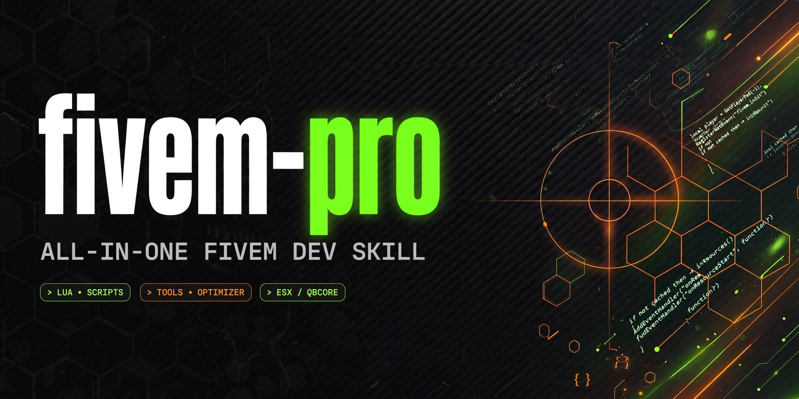

<div align="center">

# fivem-pro

**The all-in-one FiveM development skill for AI coding assistants.**

`Lua` · `QBCore` · `ESX` · `QBox` · `ox ecosystem` · `NUI` · `Deployment` · `Security` · `Mapping`

[](LICENSE)


[](https://github.com/leminhhuy113/fivem-pro/actions/workflows/lint.yml)

</div>

---

## 🎯 What is this?

`fivem-pro` teaches your AI assistant to build FiveM resources **the right way** —
from the first Lua event to a hardened, production-ready server.
One skill, fourteen domains, zero guesswork.

## ✨ What's inside

| | Domain | What the assistant learns |
|---|---|---|
| 🔧 | **Lua** | Trust boundaries, events, exports, threads, StateBags, natives |
| 🧩 | **QBCore** | Player object, callbacks, jobs, gangs, economy rules |
| 🟠 | **ESX** | xPlayer, callbacks, society, accounts |
| ⬛ | **QBox** | QBox patterns + QBCore→QBox migration |
| 📦 | **ox ecosystem** | ox_lib, oxmysql, ox_inventory, ox_target patterns |
| 🖥️ | **NUI** | Vanilla + React, focus lifecycle, CEF gotchas |
| 🚀 | **Deployment** | server.cfg, txAdmin, artifacts, multi-base layouts |
| ⚡ | **Live workflow** | Minimal restarts while the server keeps running |
| 📈 | **Performance** | resmon profiling, tick budget, entity/streaming optimization |
| 🧪 | **Testing** | Test discipline, staging flow, pre-deploy checklist |
| 🔁 | **CI/CD** | GitHub Actions: lint, format check, auto-release |
| 🩺 | **Troubleshooting** | Symptom → cause → fix FAQ |
| 🛡️ | **Security** | Anticheat hardening, detection patterns, exploit case studies, audit checklist |
| 🗺️ | **Mapping** | MLO / interior creation with Sollumz + CodeWalker |

Plus: `CHEATSHEET.md` (one-page quick reference) and `examples/template-resource/`
(a minimal secure resource demonstrating every Iron Rule).

## 🚀 Install

**Claude Code / Codex / Cursor** — copy to your skills directory:

```bash
cp -r fivem-pro ~/.claude/skills/

# or per-project:
cp -r fivem-pro /path/to/project/.claude/skills/
```

## 🧠 The Iron Rules

Everything this skill produces follows four rules:

1. **Client is never trusted** — validate every payload server-side, derive the actor from `source`.
2. **Explicit manifests** — fxmanifest load order is deliberate, no magic.
3. **No busy loops** — `Wait()` your threads, respect the tick budget.
4. **Clean NUI lifecycle** — focus in, focus out, cleanup on resource stop.

## 🗺️ Skill map

```
fivem-pro/
├── SKILL.md              # router + iron rules + triage
├── README.md
├── LICENSE
├── CHANGELOG.md
├── CHEATSHEET.md         # one-page quick reference
├── selene.toml           # FiveM-aware Lua lint config
├── .github/workflows/
│   └── lint.yml          # CI: selene + StyLua on PRs
├── examples/
│   └── template-resource/  # minimal secure resource (every Iron Rule demoed)
└── references/
    ├── lua.md            # FiveM Lua conventions
    ├── qbcore.md         # QBCore framework patterns
    ├── esx.md            # ESX framework patterns
    ├── qbox.md           # QBox patterns + migration
    ├── ox-ecosystem.md   # ox_lib / oxmysql / ox_inventory / ox_target
    ├── nui.md            # NUI development (vanilla + React)
    ├── deployment.md     # FXServer deployment
    ├── workflow.md       # live resource workflow
    ├── performance.md    # resmon profiling + optimization
    ├── testing.md        # test discipline + pre-deploy checklist
    ├── cicd.md           # GitHub Actions for FiveM resources
    ├── troubleshooting.md # symptom → cause → fix FAQ
    ├── security.md       # anticheat + detection + exploit cases + audit
    └── maps-sollumz.md   # map / MLO creation
```

## 🤝 Contributing

Issues and PRs are welcome. Keep additions framework-agnostic where possible —
and defensive: this skill is about **building** servers, not breaking them.

## 📄 License

MIT — written from scratch by **1MS Studio**. See [LICENSE](LICENSE).
